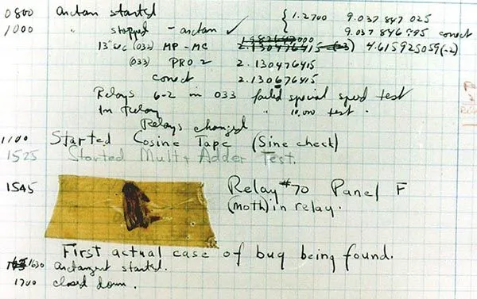
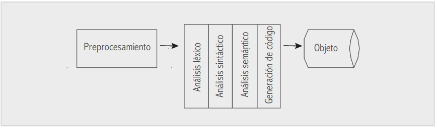
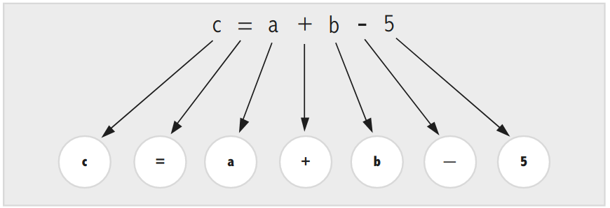
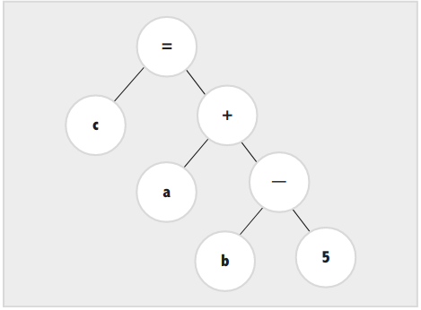
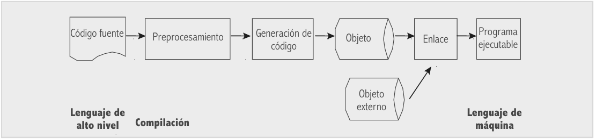

== Introducción a la programación estructurada

=== Paradigmas de programación

Los lenguajes de programación han evolucionado y se han creado nuevos
paradigmas que tienen como objetivo resolver nuevos tipos de problemas.

[arabic]
. Programación procedural
. Programación modular
. Abstracción de datos
. Programación orientada a objetos
. Programación genérica

==== Programación procedural

Este paradigma se basa en la creación de funciones o procedimientos como
nuevas operaciones.

Cuando los programas comienzan a ser más complejos, no es sencillo
resolver el problema como una única función. En el desarrollo del
software se estudian las tareas que queremos tener resueltas para el
problema, y se implementan los algoritmos correspondientes como
funciones o procedimientos.

Estas funciones ocultan los detalles del algoritmo que implementan, y
ofrecen la posibilidad de utilizarlo en base a una interfaz bien
definida.

Por ejemplo, podemos definir una función que contiene todos los pasos
necesarios para obtener la raíz cuadrada de un parámetro de doble
precisión en punto flotante.

....
double raizCuadrada(double x) {
    // Código para resolver la raíz cuadrada
}
....

Así, una llamada a la operación sólo necesita conocer la interfaz,
obviando los detalles internos.

Con respecto al diseño procedural, Dijkstra y otros propusieron utilizar
un conjunto de construcciones lógicas limitadas, concretamente la
_secuencia_, la _condición_ y la _repetición_ al desarrollar un
programa. De esta forma, una función sólo tiene una entrada y una
salida. Además, cada una de las tareas a realizar puede anidarse, es
decir, una tarea puede ser otro conjunto de tareas y estructuras de
control con una única entrada y salida (podemos considerar este
anidamiento como la estructura del programa en procedimientos).

Finalmente, conviene destacar, que un ejemplo dogmático de estas
construcciones puede implicar una pérdida de eficiencia y complicar el
código.

==== Programación modular

Cuando el problema se hace muy complejo, es recomendable dividirlo en
subproblemas para que sea más fácil de resolver. Así podemos
enfrentarnos a la búsqueda de soluciones para éstos, y que unidas,
podrán ofrecernos el programa que deseamos.

La programación modular se basa en la creación de unidades, denominadas
módulos, y que corresponden a un conjunto de procedimientos y de datos
relacionados entre sí. Nótese que una función o procedimiento lo podemos
considerar un módulo simple.

Cuando se desarrolla un módulo, es necesario también definir la interfaz
para acceder a su funcionalidad. Lógicamente, todos los detalles,
funciones o datos que son necesarios para la interfaz, se pueden obviar
a la hora de utilizarlo. Así, en un módulo podemos encontrar datos y
funciones ocultas en el sentido de que no se utilizan, más que para el
funcionamiento interno del módulo.

Por ejemplo, el lenguaje C++ ofrece:

* *Compilación separada*. Permite dividir el código en distintos
archivos. De esta forma podemos agrupar los datos y procedimientos
asociados según su almacenamiento físico. Podemos considerar dos tipos
de archivos, los que almacenan la interfaz o cabecera (extensión _.h_) y
otros con las definiciones (con extensión _.cpp_).
* *Espacios de nombres*. Permite indicar que un conjunto de indicadores
están relacionados, asignandoles un espacio de nombres (_namespace_).
Posteriormente, para utilizar alguno de ellos, necesitamos especificar
el espacio al que pertenece, anteponiendo el nombre del _namespace_ con
el separador _::_. Por ejemplo, para usar _cout_, se necesita indicar
que está dentro de _std_, por lo tanto en el código se debe indicar
_std::cout_.

==== Abstracción de datos

Hasta ahora, nos hemos centrado en los algoritmos y como nos enfrentamos
a su creciente dificultad. Sin embargo, cuando los problemas a resolver
son más complicados, las estructuras de datos también son más complejas.

La solución a un problema puede implicar el manejo de una compleja
estructura de datos que representa algún tipo de información en nuestro
problema. Si al algoritmo añadimos la posible complejidad de los
detalles de esta estructura, puede resultar más difícil, y con un
programa resultado de peor calidad.

Para aliviar estos problemas se propone el uso de la abstracción de
datos. La idea básica consiste en desarrollar un módulo que resuelva los
problemas de manejo de esa estructura, ocultando todos los detalles
innecesarios por medio de una interfaz sencilla que ofrezca la
funcionalidad que necesitamos para nuestros algoritmos.

La forma más cómoda para usar la abstracción de datos es la definición
de un nuevo tipo de dato, con una interfaz adecuada y que tenga un
comportamiento idéntico a los tipos predefinidos del lenguaje.

Por ejemplo, si desarrollamos un programa para tratamiento matemático y
necesitamos manejar polinomios, puede resultar engorroso arrastrar todos
los detalles de su implementación a lo largo de los algoritmos. Es más
sencillo disponer de un tipo _Polinomio_ que nos ofrezca la
funcionalidad que necesitamos, por ejemplo, sumas, restas, productos,
evaluación, etc. en una interfaz bien definida, para la que no es
necesario conocer cómo se ha representado en una estructura de datos.

El lenguaje C++ ofrece la posibilidad de crear nuevos tipos de datos
mediante la creación de una _clase_ y los mecanismos necesarios para su
utilización, como los constructores para inicializar las variables, un
método para implementar la forma de copiar un objeto, sobrecarga, etc.

==== Programación orientada a objetos

En las secciones anteriores la discusión se ha basado en un modelo en el
que los datos y los algoritmos se manejan de forma independiente, por un
lado tenemos los datos que trata el problema y por otro los algoritmos
que los transforman. En este sentido, podemos decir que eran soluciones
orientadas a al flujo de datos.

Para poder implementar las soluciones de los modelos orientados a
objetos, los lenguajes soportan este paradigma de programación basándose
en los siguientes principios:

[arabic]
. Encapsulamiento
. Herencia
. Polimorfismo

El encapsulamiento nos permite combinar los datos y las operaciones en
un miso objeto, de forma que éste ofrezca una interfaz de comunicación
para relacionarse con otros objetos, haciendo inaccesibles todos los
detalles internos de su funcionamiento.

La herencia es un mecanismo que permite indicar que una clase de objetos
hereda las propiedades de otra. Por ejemplo, podemos tener un sistema de
gestión en el que hay que procesar los datos de los empleados. Para ello
podemos crear una clase de objetos _empleado_. En ésta, se resuelven los
problemas comúnes de cualquier empleado. Por ejemplo, se almacenan datos
personales, tiene operaciones para calcular la antigüedad del empleado,
etc.

Ahora bien, si queremos añadir un nuevo tipo de objeto, por ejemplo
_Directivo_, no es necesario indicar que, para esta clase de objetos,
hay que almacenar datos personales, fecha de incorporación, etc. Sólo
tenemos que indicar en el programa que hereda las propiedades de un
_empleado_. Así, con esa operación tan simple, ya disponemos de un
objeto con todos los datos y operaciones que se habían definido para
_empleado_, ahora sólo se deben modificar las diferencias.

El _polimorfismo_ permite que un objeto determine, en tiempo de
ejecución, la operación a realizar. Por ejemplo, supongamos que un
sistema de diseño gráfico para el que tenemos un conjunto de objetos,
tales como: _circunferencia_, _rectángulo_ y _triángulo_. Todos ellos
tienen área, por lo tanto pueden tener una operación para calcular y
devolver su valor. Imaginemos que queremos una función para escribir en
pantalla el área de una _figura_, siendo cualquiera de las anteriores
mencionadas. El polimorfismo permite definir una única función que,
tomando como parámetro _figura_, escribe en pantalla su área.

Por supuesto, en tiempo de ejecución la función llamará a la operación
correspondiente dependiendo del tipo de figura.

==== Programación genérica

En programación existen múltiples algoritmos que se repiten
continuamente, y que por tanto, es necesario implementar para distintos
tipos de datos o entornos de programación. Por ejemplo, en un programa
podemos necesitar un algoritmo de ordenación de números enteros y de
números flotantes. El algoritmo es idéntico, aunque en muchos lenguajes
será necesario disponer de dos funciones para resolverlo.

La programación genérica hace referencia a la implementación de
algoritmos para aplicarlos en múltiples ocasiones. En lugar de construir
un algoritmo particular para cada caso, es posible especificar un
algoritmo general compuesto de todos los pasos comunes a cada una de las
implementaciones, y que el lenguaje nos permitirá aplicar para todos los
casos. Como es de esperar, el único requisito es que cada paso del
algoritmo general sea compatible con cada tipo particular.

La programación genérica es una técnica para la _reutilización_, que es
un concepto muy importante en la mejora de la productividad y la calidad
del software.

==== Desarrollo de programas

En la actualidad podemos considerar fundamentalmente, dos tendencias en
el desarrollo de software:

[arabic]
. _Análisis y diseño estructurado_. El sistema se modela con un enfoque
orientado al flujo de datos. Se pueden aplicar los paradigmas de
programación procedural, modular, abstracción de datos e incluso
programación genérica para el desarllo de software.
. _Análisis y diseño orientado a objetos_. El sistema se modela con un
enfoque orientado a objetos y se utiliza el paradigma orientado a
objetos.

=== Características de la programación estructurada

La programación estructurada es un paradigma de programación basado en
utilizar funciones o subrutinas, y únicamente tres estructuras de
control:

* secuencia: ejecución de una sentencia tras otra.
* selección o condicional: ejecución de una sentencia o conjunto de
sentencias, según el valor de una variable booleana.
* iteración (ciclo o bucle): ejecución de una sentencia o conjunto de
sentencias, mientras una variable booleana sea verdadera.

Este paradigma establece que toda función computable puede ser
implementada en un lenguaje de programación que combine sólo estas tres
estructuras lógicas o de control.

La estructura de secuencia es la que se da naturalmente en el lenguaje,
ya que por defecto las sentencias son ejecutadas en el orden en que
aparecen escritas en el programa.

=== Codificación, depuración y compilación

==== Codificación

En términos generales se puede decir que la codificación es la acción y
resultado de codificar algo. Implícitamente se entiende que existe
alguna equivalencia entre lo que se desea codificar y el resultado. En
un significado más específico a la programación para el término, se dice
que _la codificación es el proceso de escribir un algoritmo en algún
lenguaje de programación_.

==== Depuración

La depuración de programas es el proceso de identificar y corregir
errores de programación. En inglés se conoce como debugging, porque se
asemeja a la eliminación de bichos (bugs), manera en que se conoce
informalmente a los errores de programación.

La palabra bug se originó en ingeniería. La aplicación del concepto a la
computación se ha atribuido a la pionera de programación, Grace Hopper.
En 1944, Hopper, que era entonces una joven oficial de la reserva naval,
se puso a trabajar en el equipo de la computadora Mark I en Harvard. Más
tarde describió un incidente en el que se dice que un técnico realmente
extrajo un insecto (una polilla, de hecho) de entre dos conjuntos de
cableado en la computadora Mark II. La polilla fue exhibida durante
muchos años por la Marina y ahora es propiedad del Instituto
Smithsonian.

==== Compilación

La compilación es el proceso que, en sí, traduce el lenguaje de alto
nivel en lenguaje de máquina. Dentro de esta etapa pueden reconocerse,
al menos, cuatro fases:

[arabic]
. Análisis léxico.
. Análisis sintáctico.
. Análisis semántico.
. Generación de código.

El _análisis léxico_ extrae del archivo fuente todas las cadenas de
caracteres que reconoce como parte del vocabulario y genera un conjunto
de tokens como salida. En caso de que parte del archivo de entrada no
pueda reconocerse como lenguaje válido, se generarán los mensajes de
error correspondientes.

A continuación, durante el análisis sintáctico, se procesa la secuencia
de tokens gene- rada con anterioridad, y se construye una representación
intermedia, que aún no es lenguaje de máquina, pero que le permitirá al
compilador realizar su labor con más facilidad en las fases sucesivas.
Esta representación suele ser un árbol.

Durante el análisis semántico se utiliza el árbol generado en la fase
previa para detectar posibles violaciones a la semántica del lenguaje de
programación, como podría ser la declaración y el uso consistente de
identificadores (por ejemplo, que el tipo de dato en el lado derecho de
una asignación sea acorde con el tipo de dato de la variable destino, en
el lado izquierdo de la asignación).

Por último, en la generación de código se transforma la representación
intermedia en lenguaje de máquina (código objeto). En los casos típicos
esta fase involucra mucho trabajo relacionado con la optimización del
código, antes de generarse el lenguaje de máquina.

Compilar es el proceso de transformar un programa informático escrito en
un lenguaje en un programa equivalente en otro formato. Al programa que
se encarga de compilar se le llama compilador. A veces, a esta tarea se
le llama ``__ensamblar__'' o ``__construir__'', lo que suele implicar
otros procesos adicionales, e.j. empaquetarlo en formato binario.

Normalmente, un compilador transforma un lenguaje de alto nivel como C o
Java, el cual es legible por los humanos, en un lenguaje máquina que la
CPU puede entender. algunos compiladores que traducen de un lenguaje a
otro del mismo nivel son llamados transpiladores, por ejemplo al
compilar de TypeScript a JavaScript. Son considerados herramientas de
productividad.

Muchos compiladores funcionan de forma anticipada (AOT) o en tiempo de
ejecución (JIT). Como programador, normalmente llamas a los compiladores
AOT mediante la linea de comandos o el IDE que estés usando. Un ejemplo
es el famoso compilador ``gcc''. Los compiladores JIT suelen ser
transparentes para el programador. Por ejemplo en los exploradores: el
motor javaScript de SpiderMonkey, de FireFox tiene un JIT embebido que
compila el JavaScript de una web a código máquina mientras navegas.
Proyectos como WebAssembly trabajan para mejorar esto.

=== Enlace, carga y ejecución de programas

No siempre las aplicaciones se construyen de manera monolítica, a partir
de un solo archivo fuente. En la práctica sólo se escribe una parte, y
lo demás se toma de bibliotecas externas que, en la última etapa de la
compilación, se enlazarán unas con otras para generar la aplicación
ejecutable final. Ésta es, básicamente, la tarea del enlazador.

Los archivos objeto que se enlazan con nuestro programa se denominan
bibliotecas externas que, por su parte, pueden haber sido construidas
por nosotros mismos o pueden provenir de terceras partes (por ejemplo,
las bibliotecas estándares del compilador). Una biblioteca, en este
contexto, es una colección de funciones. Este tipo de archivos almacena
el nombre de cada función, los códigos objeto de las funciones y la
información de reubicación necesaria para el proceso de enlace.
Entonces, en el proceso de enlace sólo se añade al código objeto el
código de la función a la que se hizo referencia.

Un enlazador (en inglés, linker) es un programa que toma los objetos
generados en los primeros pasos del proceso de compilación, la
información de todos los recursos necesarios (biblioteca), quita
aquellos recursos que no necesita, y enlaza el código objeto con su(s)
biblioteca(s) con lo que finalmente produce un fichero ejecutable o una
biblioteca. En el caso de los programas enlazados dinámicamente, el
enlace entre el programa ejecutable y las bibliotecas se realiza en
tiempo de carga o ejecución del programa.

=== Resumen

Luego de estudiar los conceptos fundamentales referidos a la
construcción de algoritmos, en el último capítulo se trataron las
cuestiones relacionadas con el proceso de compilación, que permite
generar un programa ejecutable. Las etapas más importantes que pueden
distin- guirse en este proceso son el preprocesamiento, la compilación y
el enlace.

El preprocesamiento, como su nombre lo indica, es una etapa previa que
tiene como finalidad ``acomodar'' el código fuente antes de que éste sea
procesado por el compilador. Para ese fin, el preprocesador modifica el
código fuente según un conjunto de directivas que el programador puede
incluir en distintos puntos del programa. La compilación condicional es
un buen ejemplo: Si se cumple cierta condición, el preprocesador podría
eliminar porciones del código del programa.

Durante la compilación se traduce el lenguaje de alto nivel en lenguaje
de máquina. Dentro de esta etapa pueden distinguirse las siguientes
fases: Análisis léxico, análisis sintáctico, aná- lisis semántico y
generación de código.

La última de las etapas, el enlace, se encarga de tomar el código de
bibliotecas externas a las que nuestro programa podría estar haciendo
referencia, y generar (a partir de nuestro código y el de las
bibliotecas externas) el programa ejecutable.

==== Referencias

[arabic]
. A. Garrido Carrillo, Fundamentos de programación en C++. Las Rozas
(Madrid): Delta Publicaciones, 2005. [En Línea] Disponible en:
https://elibro-net.eu1.proxy.openathens.net/es/ereader/anahuac/170189?page=366
. https://entrenamiento-python-basico.readthedocs.io/es/latest/leccion5/programacion_estructurada.html[Entrenamiento
Python básico]. Sitio web, consultado el 10 de Agosto 2022.
. https://es.wikipedia.org/wiki/Sintaxis[Wikipedia]. Sitio web,
consultado el 10 de Agosto.
. https://www.computerweekly.com/es/definicion/Bug[Origen del término
bug]. Sitio web, consultado el 10 de Agosto 2022.
. López, G,; Jeder, I.; Vega, A.; Análisis y diseño de algoritmos.
Alfaomega.
